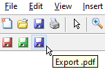
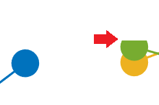

# addExportFigToolbar
Add a toolbar to Matlab figures with shortcuts for quick exporting

Sometimes you just want a simple way to quickly export a figure 'the right way'. This function adds a toolbar with a few buttons which can be assigned to your current export method of choice.
>

Matlab's built-in 'print' command is the method used out of the box. It seems to reproduce a figure's on-screen appearance fine for the most part, with the exception that exporting to .png (and possibly other bitmap formats) can cause some markers to be cut off in places (Matlab 2017a):
>

